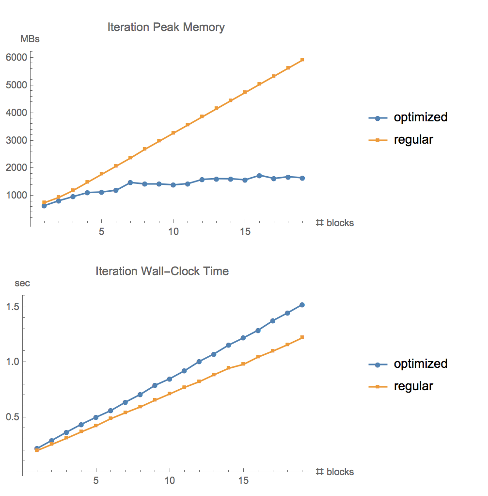

# Saving memory using gradient-checkpointing

By checkpointing nodes in a computation graph, and re-computing the parts of the graph in between those nodes during backpropagation, it is possible to calculate gradients at reduced memory cost. When training deep neural networks consisting of *n* layers, we can reduce the memory consumption to *O(sqrt(n))* in this way, at the cost of performing one additional forward pass (see e.g. [Training Deep Nets with Sublinear Memory Cost, by Chen et al. (2016)](https://arxiv.org/pdf/1604.06174.pdf)). This repository provides an implementation of this functionality in Tensorflow, using the [Tensorflow graph editor](https://www.tensorflow.org/versions/r1.0/api_guides/python/contrib.graph_editor) to automatically rewrite the computation graph of the backward pass.

## Setup requirements
```
pip install tf-nightly-gpu
pip install toposort networkx pytest
```

## Usage
This repository provides a drop-in replacement for [tf.gradients](https://www.tensorflow.org/api_docs/python/tf/gradients) in base Tensorflow. Import this function using

```
from memory_saving_gradients import gradients
```
and use the `gradients` function like you would normally use `tf.gradients` to compute gradients of losses to parameters. (This assumes you are explicitly calling `tf.gradients`, rather than implicitly inside a `tf.train.Optimizer`).

In addition to the regular arguments to tf.gradients, our gradients function has one additional argument, *checkpoints*. The *checkpoints* argument tells the gradients function which nodes of the graph you want to checkpoint during the forward pass through your computation graph. The nodes in between the checkpoints are then recomputed during the backward pass. You can supply a list of tensors to checkpoint, `gradients(ys,xs,checkpoints=[tensor1,tensor2])`, or you can use one of several keywords:

- 'collection' (default): This checkpoints all tensors returned by `tf.get_collection('checkpoints')`. You then need to make sure you add tensors to this collection using `tf.add_to_collection('checkpoints', tensor)` when you define your model.
- 'memory' : This uses a heuristic to automatically select a set of nodes to checkpoint which achieves our desired *O(sqrt(n))* memory usage. The heuristic works by automatically identifying *articulation points* in the graph, i.e. tensors which split the graph into two disconnected parts when removed, and then checkpointing a suitable number of these tensors. This currently works well for many, but not all, models.
- 'speed' : This option tries to maximize running speed by checkpointing the outputs of all ops that are typically expensive to compute, namely convolutions and matrix multiplies.

### Overwriting tf.gradients
A useful alternative to using the new `gradients` function directly is to just overwrite the function that python has registered to the `tf.gradients` name. This can be done as follows:

```
import tensorflow as tf
import memory_saving_gradients
# monkey patch tf.gradients to point to our custom version, with automatic checkpoint selection
def gradients_memory(ys, xs, grad_ys=None, **kwargs):
  return memory_saving_gradients.gradients(ys, xs, grad_ys, checkpoints='memory', **kwargs)
tf.__dict__["gradients"] = gradients_memory
```
Following this, all calls to `tf.gradients` will use the memory saving version instead.

## Tests
The test folder contains scripts for testing the correctness of the code and to profile the memory usage for various models. After modifying the code you can run `./test/run_all_tests.sh` to execute the tests.

*Testing memory usage and running time for ResNet on CIFAR10 for different numbers of layers*

## Limitations
The provided code does all graph manipulation in python before running your model. This is slow for large graphs, and can be sub-optimal since we do not have access to all information available at run time. The current algorithm for automatically selecting checkpoints is purely heuristic and is expected to fail on some models outside of the class we have tested. Although this approach has proven useful in our work, a better solution would be to implement gradient checkpointing in a compiler to be executed at run time. We have been told the Tensorflow team is working on this.
